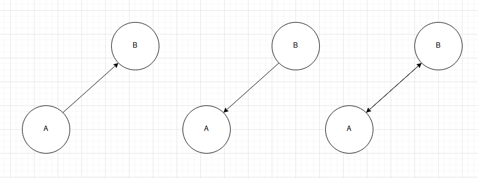
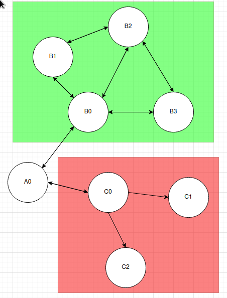
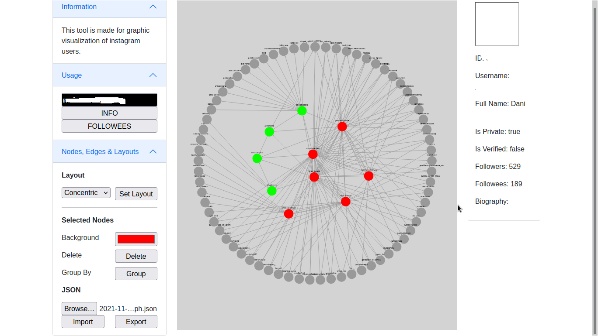

# CYTO INSTA MAP

## Description

The goal of this project is to materialize an idea:

**Simple Relation**



Two nodes:

- If A is interested on B, A follows B.
- If B is interested on A, B follows B.
- If both parts are interested on each other, both follows each other.

**Complex Relation**



More than two nodes:

If there are more than two nodes, we have to analyze the behavior of those nodes.

- If multiple nodes follow each others, this is a relation. For example, the B's nodes are related. This could be a relation like classmates, roommates, gamer friends, etc. The have one or more interests in common.
- Else, this just reflects the interest of one node (C0). C1 and C2 are independient, but we know C0 has one or more interests in C1 and C2.

We could also analyze number of followers/following (insta-famous, fucking-bot, whatever).

## Social Networks

This is exactly what happen on social networks. Let's apply this to insta!

## ALERT!

We are using instaloader, a module for instagram scraping. We need two things:

- An **Instagram account** (they blocked me like 8 accounts due to "rare behaviors" xd, **you can create as much accounts as you want without phone using protonmail** xddd)
- Login with that account on the terminal by executing "**instaloader --login YOUR_ACCOUNT_NAME**". This create a session file. Its better than being login in on each request :)

## Installation

You need to have python (>=3.8) and pip.

Run in a terminal:

```bash
# Create a virtuale environment
virtualenv .env
# Activate the virtual environment
source .env/bin/activate
# Install the requirements in the virtuale environment
pip install -r requirements.txt
python3 run.py
```

## Config

Two variables at the top of run.py:

```python
class Config:
    MAX_NO_FOLLOWEES = 600
    CRAWLER_NAME = ""
```

I use 600 because it's good enough. More can make insta returns you [429 Too Many Requests](https://instaloader.github.io/troubleshooting.html) or get banned.

## Web GUI



Left Column:

- Get info about user
- Get followees
- Change layout (very useful)
- Change color of node/s
- Delete node/s
- Import Export

Body:

- Cytoscape JS Canvas

Right Column:

- Users Information

## Modules

Backend:

- Flask
- Flask-RESTX
- flask-CORS
- instaloader

Frontend:

- jquery
- bootstrap
- cytoscape.js